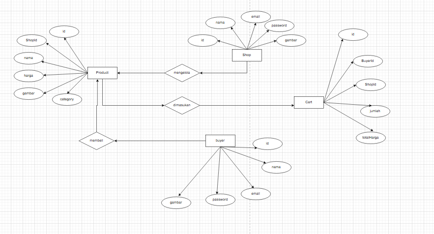
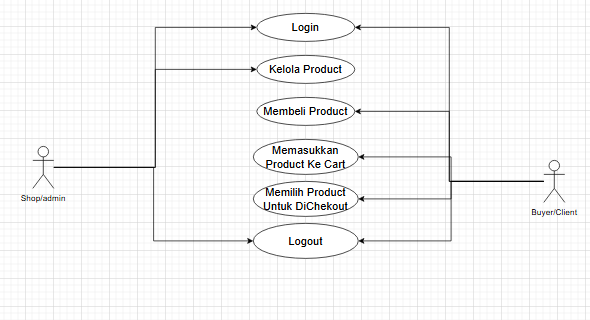
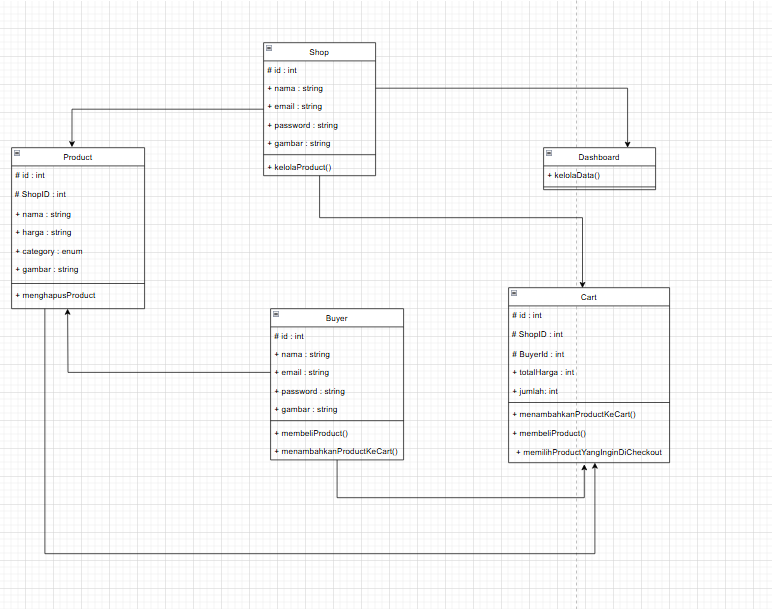

# REST API E-COMMERCE PENJUALAN SPAREPART

### DESKRIPSI PROJEK

- ***API E-COMMERCE PENJUALAN SPAREPART*** adalah sebuah rest api yang dibuat untuk memungkinkan terjadinya transaksi pembelian sparepart kendaraan dan alat alat bengkel pada sisi client/buyer, dan juga penambahan dan pengelolaan sebuah toko dari sisi shop. Projek ini dibuat dengan menggunakan Express JS sebagai framework dan juga Sequelize sebagai ORM nya.

### TEKNOLOGI YANG DIGUNAKAN
1. Express JS
2. Mysql
3. dotenv
4. CORS
5. Sequelize
6. Nodemon
7. Body-Parser

### STRUKTUR FOLDER
- Models : Untuk membuat model dari setiap table di database
- Controllers : Untuk mengatur logika aplikasi seperti login, register, CRUD
- Routes : Untuk mendefinisikan rute dari setiap API- 
- Utils : Sebagai penyimpan fungsi tambahan seperti koneksi dengan database, dan lain-lain
### CARA PENGGUNAAN

1. Pastikan Node.js dan npm sudah terinstall.
2. Clone atau download projek ini.
3. Jalankan npm install pada terminal untuk menginstall dependensi yang diperlukan.
4. Buat file .env dan beri variabel PORT dan DB_NAME (lalu sesuaikan PORT dan juga DB_NAME dengan database yang diguanakan).
5. Jalankan node models/index.js pada terminal untuk membuat table.
6. Jika table database sudah dibuat jalankan aplikasi dengan mengetikkan node index.js / nodemon index di terminal.
7. Aplikasi akan berjalan di http://localhost:PORT, dengan PORT adalah nomor port yang ditentukan dalam file .env.
## UML

### Entity Relationship Diagram ( ERD )

### USECASE

### CLASS DIAGRAM
